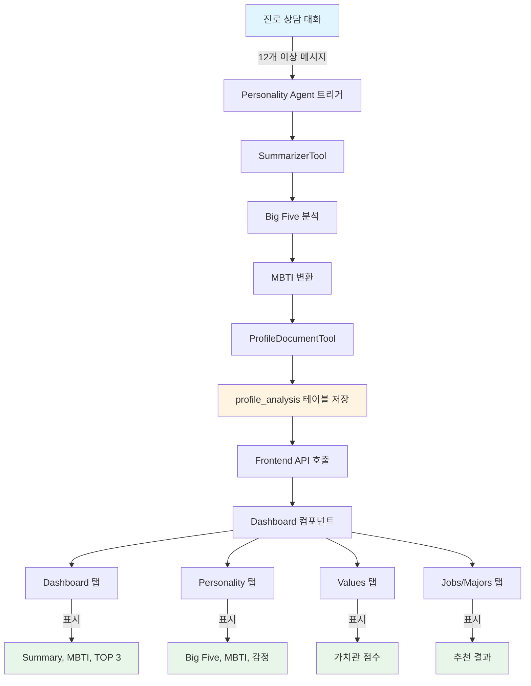

# Personality Agent & 성향 프로파일링 UI 분석 보고서

**분석 일시**: 2025-12-09  
**대상**: DreamPath Personality Agent 및 프로필 대시보드 UI

---

## 📋 요약 (Executive Summary)

Personality Agent는 진로 상담 대화 내용을 분석하여 **7가지 핵심 데이터**를 추출합니다. 현재 프로필 대시보드는 **11개 탭**으로 구성되어 있으나, Agent가 추출한 데이터 중 **일부가 UI에 표시되지 않고 있습니다**. 본 보고서는 Agent의 분석 내용과 UI 구조를 상세히 분석하고, UI 개선 방안을 제시합니다.

---

## 1️⃣ Personality Agent 분석 내용

### 1.1 트리거 조건

**파일**: `ai-service/services/agents/personality_pipeline.py` (27번 줄)

```python
if message_count < 12 and token_count < 1500:
    return {"status": "not_triggered"}
```

**트리거 조건**:
- 메시지 수 **12개 이상** OR
- 토큰 수 **1500개 이상**

둘 중 하나라도 충족되면 Personality Agent가 실행됩니다.

### 1.2 분석 프로세스

**파일**: `ai-service/services/agents/personality_agent.py`

Personality Agent는 다음 **5단계 파이프라인**으로 동작합니다:

1. **SummarizerTool** (`summarizer_tool.py`)
   - 대화 내용 + 설문조사 + 기존 프로필을 종합 분석
   - GPT-4o-mini 모델 사용
   - 출력: `summary`, `strengths`, `risks`, `goals`, `values`

2. **Big Five 분석** (`bigfive_service.py`)
   - 요약된 문서를 기반으로 5가지 성격 특성 점수 계산
   - 출력: `openness`, `conscientiousness`, `extraversion`, `agreeableness`, `neuroticism` (각 0~100 점수)

3. **MBTI 변환** (`mbti_service.py`)
   - Big Five 점수를 MBTI 16가지 유형으로 변환
   - 출력: `ESTJ`, `INFP` 등 MBTI 코드

4. **ProfileDocumentTool**
   - 모든 분석 결과를 하나의 문서로 통합
   - 벡터 임베딩 생성용 문서 작성

5. **데이터 저장** (`PersonalityAgentService.java`)
   - `profile_analysis` 테이블에 저장
   - 저장 컬럼: `personality` (Big Five + summary), `values` (strengths + risks), `mbti`

### 1.3 추출되는 데이터 (7가지)

| 데이터 | 타입 | 설명 | 저장 위치 |
|--------|------|------|-----------|
| **summary** | String | 사용자의 현재 심리, 동기, 위험 신호 요약 | `profile_analysis.personality` |
| **Big Five** | Object | 5가지 성격 특성 점수 (0~100) | `profile_analysis.personality` |
| **MBTI** | String | 16가지 유형 중 하나 (예: ENFP) | `profile_analysis.mbti` |
| **strengths** | Array | 강점 목록 (예: ["창의적 사고", "빠른 학습"]) | `profile_analysis.values` |
| **risks** | Array | 위험 신호 목록 (예: ["진로 불안", "낮은 자존감"]) | `profile_analysis.values` |
| **goals** | Array | 목표 목록 (예: ["대학 진학", "개발자 되기"]) | `profile_analysis.personality` |
| **values** | Array | 핵심 가치 목록 (예: ["성장", "안정성"]) | `profile_analysis.personality` |

---

## 2️⃣ 성향 프로파일링 UI 구조

### 2.1 전체 탭 구조 (11개)

**파일**: `frontend/src/pages/profile/Dashboard.tsx`

| 탭 ID | 탭 이름 | 설명 | 주요 컴포넌트 |
|-------|---------|------|---------------|
| `dashboard` | 대시보드 | 전체 요약 및 TOP 3 추천 | Overview Section |
| `profile` | 프로필 | 사용자 기본 정보 (준비 중) | Profile Section |
| `personality` | 성향 분석 | Big Five, MBTI, 감정 지표 | Personality Section |
| `values` | 가치관 분석 | 가치관 차트 및 상세 | Values Section |
| `jobs` | 직업 추천 | AI 기반 직업 추천 | HybridJobRecommendPanel |
| `majors` | 학과 추천 | AI 기반 학과 추천 | MajorRecommendPanel |
| `roadmap` | 진로 로드맵 | 단계별 진로 계획 (준비 중) | Roadmap Section |
| `counsel` | 상담 사례 | 유사 상담 사례 추천 | CounselRecommendPanel |
| `learning` | 학습 현황 | 주차별 학습 진행률 | Learning Section |
| `mentoring` | 멘토링 | 멘토링 예약 및 관리 | Mentoring Section |
| `settings` | 계정 설정 | 개인정보 확인 | Settings Section |

### 2.2 데이터 표시 위치 매핑

#### ✅ 현재 표시되는 데이터

| 데이터 | 표시 위치 | 코드 라인 | 표시 방식 |
|--------|-----------|-----------|-----------|
| **summary** | `dashboard` 탭 | 503번 줄 | 텍스트 (나의 진로 요약 카드) |
| **Big Five** | `personality` 탭 | 619-633번 줄 | Radar Chart (5가지 특성) |
| **MBTI** | `dashboard` 탭 | 500번 줄 | 텍스트 ("ENFP 유형의 잠재력...") |
| **MBTI** | `personality` 탭 | 694-703번 줄 | MBTI Insights 카드 |
| **MBTI 근거** | `personality` 탭 | 704-719번 줄 | 4가지 차원 (E/I, N/S, F/T, J/P) 설명 |
| **감정 지표** | `personality` 탭 | 676-691번 줄 | Progress Bar |
| **가치관 점수** | `values` 탭 | 729-748번 줄 | Bar Chart |

#### ❌ 표시되지 않는 데이터

| 데이터 | 현재 상태 | 문제점 |
|--------|-----------|--------|
| **strengths** | ❌ 미표시 | Agent가 추출하지만 UI에 없음 |
| **risks** | ❌ 미표시 | Agent가 추출하지만 UI에 없음 |
| **goals** | ❌ 미표시 | Agent가 추출하지만 UI에 없음 |
| **values** (가치 목록) | ❌ 미표시 | 가치관 "점수"만 표시, 텍스트 목록은 없음 |

**참고**: 코드 635-672번 줄에 `personalityNarrative.strengths`와 `growthAreas`를 표시하는 로직이 있으나, 이는 `personality.strengths`가 아닌 **다른 데이터 구조**를 참조하고 있어 실제로는 표시되지 않습니다.

---

## 3️⃣ 각 탭별 상세 분석

### 3.1 Dashboard 탭 (대시보드)

**표시 내용**:
- ✅ **나의 진로 요약 카드** (487-515번 줄)
  - MBTI 유형 표시
  - Summary 텍스트 표시
  - "상세 리포트 보기" 버튼 → `personality` 탭으로 이동
  - "로드맵 생성하기" 버튼 → `roadmap` 탭으로 이동

- ✅ **추천 직업 TOP 3** (519-552번 줄)
  - 벡터 검색 기반 추천
  - 일치도 퍼센트 표시
  - "더보기" 버튼 → `jobs` 탭으로 이동

- ✅ **추천 학과 TOP 3** (554-588번 줄)
  - 벡터 검색 기반 추천
  - 일치도 퍼센트 표시
  - "더보기" 버튼 → `majors` 탭으로 이동

- ✅ **로드맵 CTA** (590-610번 줄)
  - AI 로드맵 생성 안내
  - "로드맵 생성 시작하기" 버튼

**개선 필요 사항**:
- ❌ **strengths/risks/goals 미표시**: 요약 카드에 추가 가능
- ❌ **정적인 디자인**: 인터랙티브 요소 부족

### 3.2 Personality 탭 (성향 분석)

**표시 내용**:
- ✅ **성격 특성 분포** (617-633번 줄)
  - Radar Chart로 Big Five 5가지 특성 시각화
  - 개방성, 성실성, 정서 안정성, 우호성, 외향성

- ✅ **AI 성향 리포트** (635-673번 줄)
  - `personalityNarrative.type` (예: "창의적 사고가")
  - `personalityNarrative.description`
  - `personalityNarrative.strengths` (현재 작동 안 함)
  - `personalityNarrative.growthAreas` (현재 작동 안 함)

- ✅ **감정 반응 지표** (675-691번 줄)
  - Progress Bar로 감정 점수 표시

- ✅ **MBTI Insights** (693-703번 줄)
  - MBTI 유형 및 설명

- ✅ **MBTI 결정 근거** (704-719번 줄)
  - E/I, N/S, F/T, J/P 4가지 차원 점수 및 설명

**개선 필요 사항**:
- ❌ **strengths/risks 미표시**: `personalityNarrative` 데이터 구조 불일치
- ❌ **goals/values 미표시**: 별도 카드 필요

### 3.3 Values 탭 (가치관 분석)

**표시 내용**:
- ✅ **ValuesSummaryCard** (726번 줄)
  - 가치관 요약 정보

- ✅ **가치관 집중도 차트** (727-748번 줄)
  - Bar Chart로 창의성, 성장 지향, 안정성 점수 표시

- ✅ **ValueDetailCard** (749-756번 줄)
  - 각 가치관별 상세 카드 (3개)

**개선 필요 사항**:
- ❌ **values 텍스트 목록 미표시**: Agent가 추출한 가치 목록 (예: ["성장", "안정성"]) 미표시
- ❌ **정적 점수만 표시**: 사용자가 왜 이 가치를 중시하는지 설명 부족

### 3.4 Jobs/Majors/Counsel 탭 (추천 탭)

**표시 내용**:
- ✅ **HybridJobRecommendPanel** (1218번 줄)
  - 벡터 검색 기반 직업 추천

- ✅ **MajorRecommendPanel** (1224번 줄)
  - 벡터 검색 기반 학과 추천

- ✅ **CounselRecommendPanel** (1230번 줄)
  - 유사 상담 사례 추천

**개선 필요 사항**:
- ✅ 추천 결과는 잘 표시됨
- ❌ **추천 이유 부족**: 왜 이 직업/학과가 추천되는지 설명 부족

### 3.5 Roadmap 탭 (진로 로드맵)

**현재 상태**: 준비 중 (1242-1247번 줄)

**개선 필요 사항**:
- ❌ **goals 활용 가능**: Agent가 추출한 `goals`를 로드맵 생성에 활용
- ❌ **단계별 가이드 부재**: 목표 달성을 위한 구체적 단계 필요

---

## 4️⃣ UI 개선 권장사항

### 우선순위 1 (필수) - 누락된 데이터 표시

#### 4.1 Strengths & Risks 카드 추가 (Personality 탭)

**위치**: `personality` 탭, MBTI Insights 아래

**디자인**:
```tsx
<div className="grid grid-cols-1 md:grid-cols-2 gap-6">
  {/* Strengths Card */}
  <div className={styles['glass-card']}>
    <div className="flex items-center gap-3 mb-4">
      <div className="w-10 h-10 bg-gradient-to-br from-green-100 to-green-200 rounded-xl flex items-center justify-center">
        <Check size={20} className="text-green-600" />
      </div>
      <h3 className="text-lg font-bold text-slate-800">나의 강점</h3>
    </div>
    <div className="flex flex-wrap gap-2">
      {strengths.map((strength, idx) => (
        <span key={idx} className="px-3 py-1.5 bg-green-50 text-green-700 rounded-full text-sm font-medium">
          {strength}
        </span>
      ))}
    </div>
  </div>

  {/* Risks Card */}
  <div className={styles['glass-card']}>
    <div className="flex items-center gap-3 mb-4">
      <div className="w-10 h-10 bg-gradient-to-br from-amber-100 to-amber-200 rounded-xl flex items-center justify-center">
        <AlertCircle size={20} className="text-amber-600" />
      </div>
      <h3 className="text-lg font-bold text-slate-800">주의할 점</h3>
    </div>
    <div className="flex flex-wrap gap-2">
      {risks.map((risk, idx) => (
        <span key={idx} className="px-3 py-1.5 bg-amber-50 text-amber-700 rounded-full text-sm font-medium">
          {risk}
        </span>
      ))}
    </div>
  </div>
</div>
```

**효과**:
- Agent가 추출한 `strengths`와 `risks` 데이터 활용
- 사용자가 자신의 강점과 주의할 점을 한눈에 파악
- 진로 상담 시 구체적인 피드백 제공

#### 4.2 Goals & Values 카드 추가 (Dashboard 탭)

**위치**: `dashboard` 탭, "나의 진로 요약" 카드 내부 또는 바로 아래

**디자인**:
```tsx
{/* Goals Section */}
<div className="mt-4 p-4 bg-indigo-50 rounded-xl">
  <h4 className="text-sm font-bold text-indigo-700 mb-2 flex items-center gap-2">
    <Target size={16} />
    나의 목표
  </h4>
  <ul className="space-y-1">
    {goals.map((goal, idx) => (
      <li key={idx} className="text-sm text-slate-700 flex items-start gap-2">
        <span className="text-indigo-500">•</span>
        {goal}
      </li>
    ))}
  </ul>
</div>

{/* Values Section */}
<div className="mt-3 p-4 bg-purple-50 rounded-xl">
  <h4 className="text-sm font-bold text-purple-700 mb-2 flex items-center gap-2">
    <Heart size={16} />
    핵심 가치
  </h4>
  <div className="flex flex-wrap gap-2">
    {values.map((value, idx) => (
      <span key={idx} className="px-2 py-1 bg-purple-100 text-purple-700 rounded-lg text-xs font-medium">
        {value}
      </span>
    ))}
  </div>
</div>
```

**효과**:
- 사용자의 목표와 가치를 대시보드에서 바로 확인
- 진로 방향성을 명확히 인식
- 로드맵 생성 시 참고 자료로 활용

### 우선순위 2 (권장) - 시각적 개선

#### 4.3 Big Five 점수 상세 설명 추가

**현재 문제**: Radar Chart만 표시, 각 특성의 의미 설명 부족

**개선안**:
```tsx
<div className="mt-4 space-y-3">
  {personalityChartData.map((trait) => (
    <div key={trait.key} className="p-3 bg-gray-50 rounded-lg">
      <div className="flex items-center justify-between mb-1">
        <span className="text-sm font-bold text-gray-800">{trait.trait}</span>
        <span className="text-sm text-indigo-600 font-semibold">{trait.score}점</span>
      </div>
      <p className="text-xs text-gray-600">
        {trait.key === 'openness' && '새로운 경험과 아이디어에 대한 개방성'}
        {trait.key === 'conscientiousness' && '목표 지향적이고 계획적인 성향'}
        {/* ... 나머지 특성 설명 */}
      </p>
    </div>
  ))}
</div>
```

#### 4.4 추천 이유 표시 (Jobs/Majors 탭)

**현재 문제**: 추천 결과만 표시, 왜 추천되는지 설명 부족

**개선안**:
- 추천 카드에 "이 직업이 추천된 이유" 섹션 추가
- Big Five 특성과 연결 (예: "높은 개방성으로 인해 창의적 직업 추천")
- Strengths와 연결 (예: "빠른 학습 능력이 개발자 직무에 적합")

#### 4.5 인터랙티브 요소 추가

**개선안**:
1. **툴팁 추가**: Big Five 각 특성 위에 마우스 오버 시 상세 설명
2. **애니메이션**: 차트 로딩 시 부드러운 애니메이션
3. **필터링**: 추천 결과를 카테고리별로 필터링
4. **비교 기능**: 이전 분석 결과와 현재 결과 비교

### 우선순위 3 (선택) - 기능 확장

#### 4.6 Roadmap 탭 구현

**활용 데이터**:
- `goals`: 최종 목표 설정
- `strengths`: 활용 가능한 강점
- `risks`: 극복해야 할 약점
- Big Five: 성향에 맞는 학습 방법 제안

**구현 아이디어**:
1. **단계별 로드맵**: 목표 달성을 위한 3~5단계 계획
2. **타임라인**: 각 단계별 예상 소요 시간
3. **체크리스트**: 각 단계별 세부 과제
4. **리소스 추천**: 관련 강의, 책, 멘토 추천

#### 4.7 프로필 비교 기능

**아이디어**:
- 이전 분석 결과와 현재 결과 비교
- 성장 추이 그래프
- "3개월 전보다 성실성이 15% 증가했습니다" 같은 인사이트

#### 4.8 PDF 리포트 다운로드

**아이디어**:
- 전체 분석 결과를 PDF로 다운로드
- 진로 상담 시 자료로 활용
- 부모님/선생님과 공유

---

## 5️⃣ 데이터 흐름 다이어그램



---

## 6️⃣ 구현 우선순위 요약

| 우선순위 | 항목 | 예상 작업 시간 | 효과 |
|----------|------|----------------|------|
| **P1** | Strengths & Risks 카드 추가 | 2시간 | ⭐⭐⭐⭐⭐ |
| **P1** | Goals & Values 카드 추가 | 1.5시간 | ⭐⭐⭐⭐⭐ |
| **P2** | Big Five 상세 설명 추가 | 1시간 | ⭐⭐⭐⭐ |
| **P2** | 추천 이유 표시 | 2시간 | ⭐⭐⭐⭐ |
| **P2** | 인터랙티브 요소 추가 | 3시간 | ⭐⭐⭐ |
| **P3** | Roadmap 탭 구현 | 8시간 | ⭐⭐⭐⭐⭐ |
| **P3** | 프로필 비교 기능 | 4시간 | ⭐⭐⭐ |
| **P3** | PDF 다운로드 | 3시간 | ⭐⭐⭐ |

---

## 7️⃣ 최종 권장사항

### 즉시 개선 (P1)

1. **Strengths & Risks 카드 추가**
   - `personality` 탭에 2개 카드 추가
   - Agent가 이미 추출하는 데이터 활용
   - 사용자에게 즉각적인 가치 제공

2. **Goals & Values 표시**
   - `dashboard` 탭 "나의 진로 요약" 카드 내부에 추가
   - 사용자의 목표와 가치를 명확히 인식

### 단기 개선 (P2)

3. **Big Five 상세 설명**
   - 각 특성의 의미를 사용자 친화적으로 설명
   - 점수만 보여주는 것보다 이해도 향상

4. **추천 이유 표시**
   - 왜 이 직업/학과가 추천되는지 설명
   - Big Five, Strengths와 연결

### 장기 개선 (P3)

5. **Roadmap 탭 구현**
   - Goals 데이터를 활용한 단계별 진로 계획
   - 가장 높은 사용자 가치 제공

6. **프로필 비교 & PDF 다운로드**
   - 성장 추이 확인
   - 진로 상담 자료로 활용

---

## 📊 현재 상태 평가

| 항목 | 점수 | 비고 |
|------|------|------|
| **데이터 추출** | 10/10 | Agent가 모든 필요 데이터 추출 |
| **데이터 저장** | 10/10 | DB에 올바르게 저장됨 |
| **UI 표시** | 6/10 | 일부 데이터만 표시 (strengths, risks, goals, values 미표시) |
| **시각화** | 8/10 | Radar/Bar Chart 잘 구현됨 |
| **사용자 경험** | 7/10 | 깔끔하지만 인터랙티브 요소 부족 |
| **전체 평가** | **7.8/10** | **양호** (개선 여지 많음) |

---

## ✅ 결론

**강점**:
- Personality Agent가 7가지 핵심 데이터를 정확히 추출
- 11개 탭으로 잘 구조화된 대시보드
- Big Five, MBTI, 가치관 시각화 우수

**개선 필요**:
- **Strengths, Risks, Goals, Values 미표시** (가장 큰 문제)
- 추천 이유 설명 부족
- 인터랙티브 요소 부족
- Roadmap 탭 미구현

**권장 조치**:
1. **즉시**: Strengths/Risks/Goals/Values 카드 추가 (3.5시간)
2. **1주 내**: Big Five 설명 + 추천 이유 추가 (3시간)
3. **1개월 내**: Roadmap 탭 구현 (8시간)

이 개선사항들을 순차적으로 적용하면 사용자 만족도와 프로파일링 가치가 크게 향상될 것입니다.
