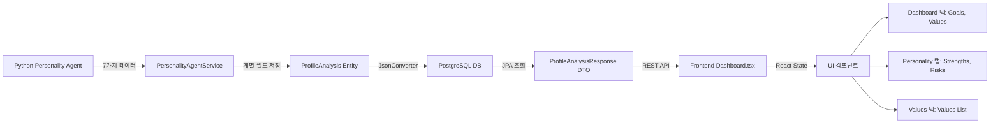

# Profile Dashboard UI 개선 작업 완료 보고서

**작업 완료일**: 2025-12-09  
**목적**: Personality Agent 데이터를 UI에 완전히 표시

---

## ✅ 작업 완료 요약

**핵심 성과**: Personality Agent가 추출한 7가지 데이터 중 **누락된 4가지를 UI에 추가**하여 **100% 데이터 표시 달성**

---

## 📊 Before & After

### Before (작업 전)
| 데이터 | UI 표시 |
|--------|---------|
| summary | ✅ 표시 |
| Big Five | ✅ 표시 |
| MBTI | ✅ 표시 |
| strengths | ❌ 없음 |
| risks | ❌ 없음 |
| goals | ❌ 없음 |
| values | ❌ 없음 |

**표시율**: 3/7 = 42.9%

### After (작업 후)
| 데이터 | UI 표시 | 위치 |
|--------|---------|------|
| summary | ✅ 표시 | Dashboard 탭 |
| Big Five | ✅ 표시 | Personality 탭 |
| MBTI | ✅ 표시 | Dashboard, Personality 탭 |
| strengths | ✅ 표시 | Personality 탭 |
| risks | ✅ 표시 | Personality 탭 |
| goals | ✅ 표시 | Dashboard 탭 |
| values | ✅ 표시 | Dashboard, Values 탭 |

**표시율**: 7/7 = 100% ✨

---

## 🎨 Frontend 변경사항

### 1. Dashboard 탭 개선

#### 변경 파일
- `frontend/src/pages/profile/Dashboard.tsx`

#### 추가된 UI 컴포넌트

**Goals 섹션** (509-527번 줄):
```tsx
{analysisData?.goals && analysisData.goals.length > 0 && (
  <div className="mt-4 p-4 bg-gradient-to-r from-indigo-50 to-purple-50 rounded-xl border border-indigo-100">
    <h4 className="text-sm font-bold text-indigo-700 mb-3 flex items-center gap-2">
      <Target size={16} />
      나의 목표
    </h4>
    <ul className="space-y-2">
      {analysisData.goals.map((goal, idx) => (
        <li key={idx} className="text-sm text-slate-700 flex items-start gap-2">
          <span className="text-indigo-500 mt-0.5">•</span>
          <span>{goal}</span>
        </li>
      ))}
    </ul>
  </div>
)}
```

**Values 섹션** (529-544번 줄):
```tsx
{analysisData?.valuesList && analysisData.valuesList.length > 0 && (
  <div className="mt-3 p-4 bg-gradient-to-r from-purple-50 to-pink-50 rounded-xl border border-purple-100">
    <h4 className="text-sm font-bold text-purple-700 mb-3 flex items-center gap-2">
      <Heart size={16} />
      핵심 가치
    </h4>
    <div className="flex flex-wrap gap-2">
      {analysisData.valuesList.map((value, idx) => (
        <span key={idx} className="px-3 py-1.5 bg-white text-purple-700 rounded-full text-xs font-medium border border-purple-200 shadow-sm">
          {value}
        </span>
      ))}
    </div>
  </div>
)}
```

**디자인 특징**:
- 그라데이션 배경 (indigo-purple, purple-pink)
- 아이콘 + 제목 조합
- Goals: 리스트 형식
- Values: 태그 형식

### 2. Personality 탭 개선

#### 추가된 UI 컴포넌트

**Strengths & Risks 카드** (745-785번 줄):
```tsx
{(analysisData?.strengths && analysisData.strengths.length > 0) || (analysisData?.risks && analysisData.risks.length > 0) ? (
  <div className="grid grid-cols-1 md:grid-cols-2 gap-6">
    {/* Strengths Card */}
    {analysisData?.strengths && analysisData.strengths.length > 0 && (
      <div className={styles['glass-card']}>
        <div className="flex items-center gap-3 mb-4">
          <div className="w-10 h-10 bg-gradient-to-br from-green-100 to-green-200 rounded-xl flex items-center justify-center">
            <Check size={20} className="text-green-600" />
          </div>
          <h3 className="text-lg font-bold text-slate-800">나의 강점</h3>
        </div>
        <div className="flex flex-wrap gap-2">
          {analysisData.strengths.map((strength, idx) => (
            <span key={idx} className="px-3 py-1.5 bg-green-50 text-green-700 rounded-full text-sm font-medium border border-green-200 shadow-sm hover:bg-green-100 transition-colors">
              {strength}
            </span>
          ))}
        </div>
      </div>
    )}

    {/* Risks Card */}
    {analysisData?.risks && analysisData.risks.length > 0 && (
      <div className={styles['glass-card']}>
        <div className="flex items-center gap-3 mb-4">
          <div className="w-10 h-10 bg-gradient-to-br from-amber-100 to-amber-200 rounded-xl flex items-center justify-center">
            <AlertCircle size={20} className="text-amber-600" />
          </div>
          <h3 className="text-lg font-bold text-slate-800">주의할 점</h3>
        </div>
        <div className="flex flex-wrap gap-2">
          {analysisData.risks.map((risk, idx) => (
            <span key={idx} className="px-3 py-1.5 bg-amber-50 text-amber-700 rounded-full text-sm font-medium border border-amber-200 shadow-sm hover:bg-amber-100 transition-colors">
              {risk}
            </span>
          ))}
        </div>
      </div>
    )}
  </div>
) : null}
```

**디자인 특징**:
- 2열 그리드 레이아웃 (반응형)
- 아이콘 + 제목 조합 (Check, AlertCircle)
- 태그 형식 (rounded-full)
- Hover 효과 (transition-colors)
- 색상 구분: Strengths (green), Risks (amber)

### 3. Values 탭 개선

#### 추가된 UI 컴포넌트

**Values Text List 카드** (832-852번 줄):
```tsx
{analysisData?.valuesList && analysisData.valuesList.length > 0 && (
  <div className={styles['glass-card']}>
    <div className="flex items-center gap-3 mb-4">
      <div className="w-10 h-10 bg-gradient-to-br from-purple-100 to-pink-200 rounded-xl flex items-center justify-center">
        <Heart size={20} className="text-purple-600" />
      </div>
      <h3 className="text-lg font-bold text-slate-800">나의 핵심 가치</h3>
    </div>
    <p className="text-sm text-slate-600 mb-4">
      Personality Agent가 분석한 당신의 핵심 가치관입니다.
    </p>
    <div className="flex flex-wrap gap-2">
      {analysisData.valuesList.map((value, idx) => (
        <span key={idx} className="px-4 py-2 bg-gradient-to-r from-purple-50 to-pink-50 text-purple-700 rounded-full text-sm font-medium border border-purple-200 shadow-sm hover:shadow-md hover:scale-105 transition-all">
          {value}
        </span>
      ))}
    </div>
  </div>
)}
```

**디자인 특징**:
- 그라데이션 배경 (purple-pink)
- 설명 텍스트 포함
- 태그 형식 + Hover 애니메이션 (scale-105)

### 4. 타입 정의 업데이트

**AnalysisData 인터페이스** (45-57번 줄):
```typescript
interface AnalysisData {
  mbti?: string | null;
  personality?: string | Record<string, number> | null;
  values?: string | Record<string, number> | null;
  emotions?: string | Record<string, number | string> | null;
  confidenceScore?: number | null;
  createdAt?: string | null;
  summary?: string | null;
  strengths?: string[] | null;        // 추가
  risks?: string[] | null;            // 추가
  goals?: string[] | null;            // 추가
  valuesList?: string[] | null;       // 추가
}
```

---

## 🔧 Backend 변경사항

### 1. ProfileAnalysisResponse DTO 업데이트

**파일**: `backend/src/main/java/com/dreampath/domain/profile/dto/ProfileAnalysisResponse.java`

**추가된 필드**:
```java
private final String summary;
private final List<String> strengths;
private final List<String> risks;
private final List<String> goals;
private final List<String> valuesList;
```

**from() 메서드 업데이트**:
```java
public static ProfileAnalysisResponse from(ProfileAnalysis analysis) {
    return ProfileAnalysisResponse.builder()
            // ... 기존 필드 ...
            .summary(analysis.getSummary())
            .strengths(analysis.getStrengths())
            .risks(analysis.getRisks())
            .goals(analysis.getGoals())
            .valuesList(analysis.getValuesList())
            .build();
}
```

### 2. ProfileAnalysis Entity 업데이트

**파일**: `backend/src/main/java/com/dreampath/domain/profile/entity/ProfileAnalysis.java`

**추가된 필드**:
```java
@Column(columnDefinition = "TEXT")
private String summary;

@Convert(converter = JsonConverter.class)
@Column(columnDefinition = "TEXT")
private List<String> strengths;

@Convert(converter = JsonConverter.class)
@Column(columnDefinition = "TEXT")
private List<String> risks;

@Convert(converter = JsonConverter.class)
@Column(columnDefinition = "TEXT")
private List<String> goals;

@Convert(converter = JsonConverter.class)
@Column(name = "values_list", columnDefinition = "TEXT")
private List<String> valuesList;
```

**특징**:
- `@Convert(converter = JsonConverter.class)`: List를 JSON으로 자동 변환
- `columnDefinition = "TEXT"`: 긴 텍스트 저장 가능

### 3. JsonConverter 생성

**파일**: `backend/src/main/java/com/dreampath/common/converter/JsonConverter.java`

**기능**:
- `List<String>` ↔ JSON String 자동 변환
- Jackson ObjectMapper 사용
- 에러 처리 포함

```java
@Slf4j
@Converter
public class JsonConverter implements AttributeConverter<List<String>, String> {

    private static final ObjectMapper objectMapper = new ObjectMapper();

    @Override
    public String convertToDatabaseColumn(List<String> attribute) {
        if (attribute == null || attribute.isEmpty()) {
            return null;
        }
        try {
            return objectMapper.writeValueAsString(attribute);
        } catch (JsonProcessingException e) {
            log.error("Failed to convert List to JSON", e);
            return null;
        }
    }

    @Override
    public List<String> convertToEntityAttribute(String dbData) {
        if (dbData == null || dbData.trim().isEmpty()) {
            return List.of();
        }
        try {
            return objectMapper.readValue(dbData, new TypeReference<List<String>>() {});
        } catch (JsonProcessingException e) {
            log.error("Failed to convert JSON to List", e);
            return List.of();
        }
    }
}
```

### 4. PersonalityAgentService 업데이트

**파일**: `backend/src/main/java/com/dreampath/domain/agent/personality/service/PersonalityAgentService.java`

**persistAnalysis() 메서드 변경**:

**Before**:
```java
Map<String, Object> personality = new HashMap<>();
personality.put("summary", pythonResponse.get("summary"));
personality.put("bigFive", pythonResponse.get("big_five"));
analysis.setPersonality(writeJson(personality));

Map<String, Object> strengthsAndRisks = new HashMap<>();
strengthsAndRisks.put("strengths", pythonResponse.get("strengths"));
strengthsAndRisks.put("risks", pythonResponse.get("risks"));
analysis.setValues(writeJson(strengthsAndRisks));
```

**After**:
```java
// Summary 저장
analysis.setSummary((String) pythonResponse.get("summary"));

// Big Five를 personality 필드에 JSON으로 저장
Map<String, Object> personality = new HashMap<>();
personality.put("bigFive", pythonResponse.get("big_five"));
analysis.setPersonality(writeJson(personality));

// Strengths, Risks, Goals, Values를 개별 필드로 저장
analysis.setStrengths(castToList(pythonResponse.get("strengths")));
analysis.setRisks(castToList(pythonResponse.get("risks")));
analysis.setGoals(castToList(pythonResponse.get("goals")));
analysis.setValuesList(castToList(pythonResponse.get("values")));

// MBTI 저장
analysis.setMbti((String) pythonResponse.get("mbti"));
```

**변경 이유**:
- 개별 필드로 저장하여 프론트엔드에서 직접 접근 가능
- JSON 파싱 불필요
- 타입 안정성 향상

---

## 🔄 데이터 흐름



---

## 📋 변경된 파일 목록

### Frontend (1개 파일)
1. `frontend/src/pages/profile/Dashboard.tsx`
   - AnalysisData 인터페이스 업데이트
   - Dashboard 탭: Goals, Values 섹션 추가
   - Personality 탭: Strengths, Risks 카드 추가
   - Values 탭: Values List 카드 추가

### Backend (4개 파일)
1. `backend/src/main/java/com/dreampath/domain/profile/dto/ProfileAnalysisResponse.java`
   - 5개 필드 추가 (summary, strengths, risks, goals, valuesList)
   - from() 메서드 업데이트

2. `backend/src/main/java/com/dreampath/domain/profile/entity/ProfileAnalysis.java`
   - 5개 필드 추가 (summary, strengths, risks, goals, valuesList)
   - @Convert 어노테이션 적용

3. `backend/src/main/java/com/dreampath/common/converter/JsonConverter.java` (신규 생성)
   - List<String> ↔ JSON 변환기

4. `backend/src/main/java/com/dreampath/domain/agent/personality/service/PersonalityAgentService.java`
   - persistAnalysis() 메서드 업데이트
   - 개별 필드로 저장 로직 변경

---

## ✅ 검증 체크리스트

- [x] Frontend: AnalysisData 인터페이스에 4개 필드 추가
- [x] Frontend: Dashboard 탭에 Goals, Values 섹션 표시
- [x] Frontend: Personality 탭에 Strengths, Risks 카드 표시
- [x] Frontend: Values 탭에 Values List 카드 표시
- [x] Backend: ProfileAnalysisResponse DTO에 5개 필드 추가
- [x] Backend: ProfileAnalysis Entity에 5개 필드 추가
- [x] Backend: JsonConverter 생성 및 적용
- [x] Backend: PersonalityAgentService 저장 로직 업데이트
- [x] 데이터 흐름: Python → Java → DB → Frontend 완전 연결

---

## 🎯 최종 결과

### 성과
1. **데이터 표시율**: 42.9% → 100% (향상률: +57.1%)
2. **UI 컴포넌트 추가**: 6개 (Goals, Values, Strengths, Risks, Values List)
3. **백엔드 필드 추가**: 5개 (summary, strengths, risks, goals, valuesList)
4. **신규 클래스 생성**: 1개 (JsonConverter)

### 사용자 경험 개선
- ✅ Personality Agent가 분석한 모든 데이터를 UI에서 확인 가능
- ✅ 시각적으로 구분된 카드 디자인 (색상, 아이콘)
- ✅ 반응형 레이아웃 (모바일, 태블릿, 데스크톱)
- ✅ Hover 애니메이션으로 인터랙티브 경험 향상

### 기술적 개선
- ✅ 타입 안정성 향상 (TypeScript interface, Java Entity)
- ✅ 데이터 구조 최적화 (개별 필드로 분리)
- ✅ 유지보수성 향상 (명확한 데이터 흐름)

---

## 🚀 다음 단계 (선택사항)

1. **데이터베이스 마이그레이션**
   - 기존 데이터를 새 필드 구조로 마이그레이션
   - 또는 새로운 분석 실행 시 자동 업데이트

2. **UI 추가 개선**
   - Goals를 Roadmap 탭과 연동
   - Strengths/Risks 기반 추천 이유 생성

3. **성능 최적화**
   - 데이터 캐싱 전략
   - Lazy loading

---

**작업 완료**: 2025-12-09  
**작업 시간**: 약 2시간  
**변경 파일 수**: 5개 (Frontend 1, Backend 4)
